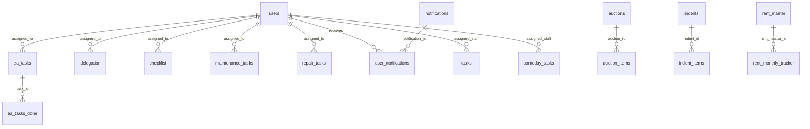

# 🗄️ DATABASE.md — Jay Bhole Master System

> Complete database schema documentation for the Supabase PostgreSQL database.

**Database Provider:** Supabase (PostgreSQL)  
**Project URL:** `https://erohensrnsfasuhzourx.supabase.co`  
**Schema:** `public`

---

## Table of Contents

- [Entity Relationship Overview](#entity-relationship-overview)
- [Core Tables](#core-tables)
- [Task Management Tables](#task-management-tables)
- [HR & Payroll Tables](#hr--payroll-tables)
- [Coal Trading Tables](#coal-trading-tables)
- [Petty Cash Tables](#petty-cash-tables)
- [Daily Scheduler Tables](#daily-scheduler-tables)
- [Help Slip Tables](#help-slip-tables)
- [Rent Management Tables](#rent-management-tables)
- [Insurance Tables](#insurance-tables)
- [Notification Tables](#notification-tables)
- [Foreign Key Relationships](#foreign-key-relationships)

---

## Entity Relationship Overview

---

## Core Tables

### `users`
> Central user table — stores all employees, admins, and system users.

| Column | Type | Constraints | Description |
|---|---|---|---|
| `id` | bigint | PK, IDENTITY | Auto-increment user ID |
| `user_name` | text | | Login username |
| `password` | text | | Login password (plaintext) |
| `email_id` | text | | Email address |
| `number` | bigint | | Phone number (for WhatsApp) |
| `role` | text | | `superadmin`, `admin`, `HOD`, `user` |
| `department` | text | | Department name |
| `designation` | text | | Job designation |
| `employee_id` | text | UNIQUE | Employee code |
| `user_access` | text | | Access level string |
| `system_access` | text | | Custom system access permissions |
| `page_access` | text | | Custom page access permissions |
| `given_by` | text | | Created/assigned by |
| `status` | enum | | Active/Inactive status |
| `profile_image` | text | | Profile photo URL |
| `can_self_assign` | boolean | DEFAULT false | Can assign tasks to self |
| `reported_by` | text | | Reporting manager |
| `joining_date` | date | | Date of joining |
| `date_of_birth` | date | | Date of birth |
| `address` | text | | Residential address |
| `fathers_name` | varchar | | Father's name |
| `alternate_phone` | varchar | | Alternate contact |
| `marital_status` | varchar | | Marital status |
| `blood_group` | varchar | | Blood group |
| `health_issues` | text | | Known health issues |
| `experience` | varchar | | Work experience |
| `aadhar_no` | varchar | | Aadhar number |
| `pan_no` | varchar | | PAN number |
| `driving_licence` | varchar | | DL number |
| `bank_name` | varchar | | Bank name |
| `account_no` | varchar | | Bank account number |
| `ifsc_code` | varchar | | IFSC code |
| `branch_name` | varchar | | Branch name |
| `base_salary` | numeric | | Base salary amount |
| `pf_applicable` | boolean | DEFAULT false | PF applicable flag |
| `esic_applicable` | boolean | DEFAULT false | ESIC applicable flag |
| `photo` | text | | Employee photo URL |
| `aadhar_doc_url` | text | | Aadhar document URL |
| `pan_doc_url` | text | | PAN document URL |
| `dl_doc_url` | text | | DL document URL |
| `account_doc_url` | text | | Passbook document URL |
| `leave_date` | timestamp | | Leave start date |
| `leave_end_date` | timestamp | | Leave end date |
| `remark` | text | | Admin remarks |
| `last_reminder_date` | date | | Last WhatsApp reminder sent date |
| `display_order` | integer | DEFAULT 0 | UI display order |
| `created_at` | timestamptz | DEFAULT now() | Record creation time |

### `departments`
| Column | Type | Constraints | Description |
|---|---|---|---|
| `id` | bigint | PK, IDENTITY | Department ID |
| `name` | text | NOT NULL, UNIQUE | Department name |
| `given_by` | text | | Created by |
| `created_at` | timestamptz | DEFAULT now() | Creation time |

### `assign_from`
| Column | Type | Constraints | Description |
|---|---|---|---|
| `id` | bigint | PK, IDENTITY | ID |
| `name` | text | NOT NULL, UNIQUE | Assigner name |
| `created_at` | timestamptz | DEFAULT now() | Creation time |

### `dropdown_options`
> Stores configurable dropdown values for forms (machine names, areas, priorities, etc.)

| Column | Type | Constraints | Description |
|---|---|---|---|
| `id` | bigint | PK, IDENTITY | ID |
| `machine_name` | text | | Machine name option |
| `machine_area` | text | | Machine area option |
| `part_name` | text | | Part name option |
| `priority` | text | | Priority option |
| `task_priority` | text | | Task priority option |
| `project_type` | text | | Project type option |
| `task_status` | text | | Task status option |
| `sound_test` | text | | Sound test option |
| `temperature` | text | | Temperature option |
| `image_url` | text | | Image URL |
| `created_at` | timestamptz | DEFAULT now() | Creation time |

### `holidays`
| Column | Type | Constraints | Description |
|---|---|---|---|
| `id` | bigint | PK, IDENTITY | ID |
| `holiday_date` | date | NOT NULL, UNIQUE | Holiday date |
| `holiday_name` | text | NOT NULL | Holiday name |
| `created_at` | timestamptz | DEFAULT now() | Creation time |

### `working_day_calender`
| Column | Type | Constraints | Description |
|---|---|---|---|
| `id` | integer | PK, IDENTITY | ID |
| `working_date` | date | | Working date |
| `day` | text | | Day name |
| `week_num` | integer | | Week number |
| `month` | integer | | Month number |

---

## Task Management Tables

### `ea_tasks` (Executive Assistant Tasks)
| Column | Type | Constraints | Description |
|---|---|---|---|
| `task_id` | integer | PK, SEQUENCE | Task ID |
| `doer_name` | text | NOT NULL | Assigned person |
| `phone_number` | text | | Contact number |
| `planned_date` | timestamptz | NOT NULL | Due date |
| `task_description` | text | NOT NULL | Task description |
| `status` | text | CHECK (pending/done/extended) | Task status |
| `given_by` | text | | Assigner name |
| `extended_date` | timestamptz | | Extension date |
| `task_start_date` | timestamptz | NOT NULL, DEFAULT now() | Start date |
| `end_date` | timestamptz | | End date |
| `duration` | text | | Duration |
| `remarks` | text | | Remarks |
| `image_url` | text | | Proof image URL |
| `audio_url` | text | | Voice note URL |
| `attachment` | boolean | | Has attachment |
| `admin_done` | boolean | | Admin approved |
| `admin_approval_date` | timestamptz | | Approval timestamp |
| `admin_approved_by` | text | | Approved by |
| `instruction_attachment_url` | text | | Instruction file URL |
| `instruction_attachment_type` | text | | Instruction file type |
| `created_at` | timestamptz | DEFAULT now() | Creation time |
| `updated_at` | timestamptz | DEFAULT now() | Last update time |

### `ea_tasks_done` (Completed EA Tasks)
| Column | Type | Constraints | Description |
|---|---|---|---|
| `id` | integer | PK, SEQUENCE | Record ID |
| `task_id` | integer | FK → ea_tasks | Original task reference |
| `doer_name` | text | | Doer name |
| `status` | text | CHECK (pending/done/approved/rejected/extended) | Completion status |
| `submission_date` | timestamptz | DEFAULT now() | When submitted |
| `image_url` | text | | Proof image |
| `reason` | text | | Extension reason |
| `next_extend_date` | timestamptz | | Next extension date |
| `admin_done` | boolean | | Admin approved |
| All other columns mirror `ea_tasks` | | | |

### `checklist` (Checklist Tasks)
| Column | Type | Constraints | Description |
|---|---|---|---|
| `task_id` | bigint | PK, IDENTITY | Task ID |
| `department` | text | | Department |
| `given_by` | text | | Assigner |
| `name` | text | | Assigned person |
| `task_description` | text | | Description |
| `frequency` | text | | Recurrence (daily/weekly/monthly) |
| `enable_reminder` | enum | | Reminder toggle |
| `require_attachment` | enum | | Attachment required toggle |
| `status` | enum | | Task status |
| `planned_date` | text | | Due date |
| `task_start_date` | timestamp | | Start date |
| `submission_date` | timestamp | | Submission date |
| `delay` | interval | | Delay duration |
| `remark` | text | | Remarks |
| `image` | text | | Proof image URL |
| `duration` | text | | Duration |
| `audio_url` | text | | Voice note URL |
| `admin_done` | boolean | DEFAULT false | Admin approved |
| `admin_approval_date` | timestamptz | | Approval time |
| `admin_approved_by` | text | | Approved by |
| `instruction_attachment_url` | text | | Instruction file |
| `instruction_attachment_type` | text | | File type |
| `created_at` | timestamp | DEFAULT now() | Creation time |

### `delegation` (Delegation Tasks)
| Column | Type | Constraints | Description |
|---|---|---|---|
| `task_id` | bigint | PK, IDENTITY | Task ID |
| `department` | text | | Department |
| `name` | text | | Assigned person |
| `task_description` | text | | Description |
| `frequency` | text | | Recurrence |
| `given_by` | text | | Assigner |
| `task_start_date` | timestamp | NOT NULL | Start date |
| `planned_date` | timestamp | | Planned completion date |
| `submission_date` | timestamp | | Actual submission |
| `status` | text | | Task status |
| `remarks` | text | | Remarks |
| `color_code_for` | bigint | | Priority color code |
| `delay` | interval | | Delay |
| `enable_reminder` | enum | | Reminder toggle |
| `require_attachment` | text | | Attachment required |
| `image` | text | | Image URL |
| `admin_done` | boolean | DEFAULT false | Admin approved |
| `duration` | text | | Duration |
| `audio_url` | text | | Voice note URL |
| `admin_approval_date` | timestamptz | | Approval time |
| `admin_approved_by` | text | | Approved by |
| `instruction_attachment_url` | text | | Instruction file |
| `instruction_attachment_type` | text | | File type |
| `created_at` | timestamp | DEFAULT now() | Creation time |
| `updated_at` | timestamp | | Last update |

### `delegation_done` (Completed Delegation Tasks)
| Column | Type | Constraints | Description |
|---|---|---|---|
| `id` | uuid | PK, DEFAULT gen_random_uuid() | Record ID |
| `task_id` | bigint | | Original task ID |
| `name` | text | | Doer name |
| `task_description` | text | | Description |
| `given_by` | text | | Assigner |
| `status` | text | | Completion status |
| `reason` | text | | Extension reason |
| `next_extend_date` | timestamp | | Next extension date |
| `image_url` | text | | Proof image |
| `admin_done` | boolean | | Admin approved |
| `duration` | text | | Duration |
| `audio_url` | text | | Voice note |
| `admin_approval_date` | timestamptz | | Approval time |
| `admin_approved_by` | text | | Approved by |
| `created_at` | timestamptz | DEFAULT now() | Creation time |

### `maintenance_tasks`
| Column | Type | Constraints | Description |
|---|---|---|---|
| `id` | bigint | PK, IDENTITY | Task ID |
| `department` | text | | Department |
| `given_by` | text | | Assigner |
| `name` | text | | Assigned person |
| `task_description` | text | | Description |
| `machine_name` | text | | Machine |
| `part_name` | text | | Part |
| `part_area` | text | | Area |
| `buddy` | text | | Secondary person |
| `freq` | text | | Frequency |
| `task_start_date` | timestamptz | | Start date |
| `planned_date` | timestamptz | | Planned date |
| `submission_date` | timestamptz | | Submission date |
| `delay` | text | | Delay |
| `status` | text | | Status |
| `remarks` | text | | Remarks |
| `uploaded_image_url` | text | | Photo URL |
| `enable_reminders` | boolean | DEFAULT false | Reminder flag |
| `require_attachment` | text | | Attachment required |
| `admin_done` | boolean | DEFAULT false | Admin approved |
| `duration` | text | | Duration |
| `audio_url` | text | | Voice note |
| `admin_approval_date` | timestamptz | | Approval time |
| `admin_approved_by` | text | | Approved by |
| `created_at` | timestamptz | DEFAULT now() | Creation time |

### `repair_tasks`
| Column | Type | Constraints | Description |
|---|---|---|---|
| `id` | bigint | PK, IDENTITY | Task ID |
| `filled_by` | text | NOT NULL | Reported by |
| `assigned_person` | text | NOT NULL | Assigned to |
| `machine_name` | text | NOT NULL | Machine |
| `issue_description` | text | NOT NULL | Issue details |
| `part_replaced` | text | | Replaced parts |
| `status` | text | DEFAULT 'Pending' | Status |
| `submission_date` | timestamptz | | Completion date |
| `remarks` | text | | Remarks |
| `bill_amount` | text | | Repair cost |
| `vendor_name` | text | | Vendor |
| `work_photo_url` | text | | Work photo |
| `bill_copy_url` | text | | Bill copy |
| `duration` | text | | Duration |
| `audio_url` | text | | Voice note |
| `attachment` | boolean | | Has attachment |
| `admin_approval_date` | timestamptz | | Approval time |
| `admin_approved_by` | text | | Approved by |
| `created_at` | timestamptz | DEFAULT now() | Creation time |

---

## HR & Payroll Tables

### `monthly_attendance`
| Column | Type | Description |
|---|---|---|
| `id` | bigint (PK) | Record ID |
| `employee_id` | text (NOT NULL) | Employee code |
| `employee_name` | varchar | Employee name |
| `month_year` | text (NOT NULL) | Format: "YYYY-MM" |
| `day_1` to `day_31` | text | Daily attendance status (P/A/H/L/HD/WO) |
| `salary` | numeric | Monthly salary |
| `created_at`, `updated_at` | timestamptz | Timestamps |

### `leave_allotments`
| Column | Type | Description |
|---|---|---|
| `employee_id` | text (PK) | Employee code |
| `cl` | integer (DEFAULT 0) | Casual Leave balance |
| `sl` | integer (DEFAULT 0) | Sick Leave balance |
| `el` | integer (DEFAULT 0) | Earned Leave balance |
| `updated_at` | timestamptz | Last update |

### `leave_requests`
| Column | Type | Description |
|---|---|---|
| `id` | bigint (PK) | Request ID |
| `employee_id` | text (NOT NULL) | Employee code |
| `leave_type` | text | CHECK: CL, SL, EL |
| `start_date`, `end_date` | date | Leave period |
| `days` | integer | Number of days |
| `status` | text | CHECK: Pending, Approved, Rejected |
| `reason` | text | Leave reason |
| `created_at` | timestamptz | Request time |

### `salary_structures`
| Column | Type | Description |
|---|---|---|
| `employee_id` | text (PK) | Employee code |
| `basic` | numeric (DEFAULT 0) | Basic salary |
| `hra` | numeric (DEFAULT 0) | House Rent Allowance |
| `allowances` | numeric (DEFAULT 0) | Other allowances |
| `prof_tax` | numeric (DEFAULT 0) | Professional tax |
| `other_deductions` | numeric (DEFAULT 0) | Other deductions |
| `pf_applicable` | boolean (DEFAULT true) | PF deduction flag |
| `esic_applicable` | boolean (DEFAULT false) | ESIC deduction flag |
| `total_days`, `present_days`, `absent`, `half_days`, `holidays`, `leaves` | numeric | Attendance counters |
| `leave_deduction` | numeric | Leave deduction amount |
| `month_advance`, `month_recovery`, `prev_advance_deduction` | numeric | Advance/recovery tracking |
| `salary_date` | date | Salary date |
| `salary_month` | text | Salary month |
| `payment_status` | text (DEFAULT 'Pending') | Payment status |
| `bank_account` | text | Bank account |
| `updated_at` | timestamptz | Last update |

### `processed_payroll`
| Column | Type | Description |
|---|---|---|
| `id` | bigint (PK) | Record ID |
| `employee_id` | text (NOT NULL) | Employee code |
| `employee_name` | text | Employee name |
| `month_year` | text (NOT NULL) | Payroll month |
| `gross` | numeric (NOT NULL) | Gross salary |
| `deductions` | numeric (NOT NULL) | Total deductions |
| `net` | numeric (NOT NULL) | Net salary |
| `basic`, `hra`, `allowances` | numeric | Earnings breakdown |
| `pf_deduction`, `esic_deduction`, `ptax` | numeric | Statutory deductions |
| `absent_deduction`, `other_deductions` | numeric | Other deductions |
| `payment_status` | text (DEFAULT 'Pending') | Payment status |
| `bank_account` | text | Bank account |
| `salary_date` | text | Salary date |
| `created_at` | timestamptz | Processing time |

### `payroll_settings`
| Column | Type | Description |
|---|---|---|
| `id` | integer (PK, DEFAULT 1) | Always 1 (singleton) |
| `pf_percentage` | numeric (DEFAULT 12) | PF % |
| `ptax_amount` | numeric (DEFAULT 200) | P.Tax amount |
| `updated_at` | timestamptz | Last update |

### `employee`
| Column | Type | Description |
|---|---|---|
| `id` | integer (PK) | Employee ID |
| `name` | varchar (NOT NULL) | Name |
| `salary` | numeric (DEFAULT 0) | Salary |

### `attendance`
| Column | Type | Description |
|---|---|---|
| `id` | bigint (PK) | Record ID |
| `employee_id` | integer (NOT NULL) | Employee ID |
| `employee_name` | text | Name |
| `attendance_date` | date (NOT NULL) | Date |
| `check_in`, `check_out` | timestamptz | Check-in/out times |
| `working_hours` | text | Hours worked |
| `attendance_type` | text | Type |
| `latitude`, `longitude` | numeric | GPS coordinates |
| `address` | text | Check-in location |
| `image` | text | Selfie URL |
| `device_info` | text | Device info |
| `remarks` | text | Remarks |
| `status` | text | Status |
| `created_at` | timestamptz | Creation time |

### `indents` & `indent_items`
| Table | Key Columns |
|---|---|
| `indents` | `id` (PK), `indent_number` (UNIQUE), `department_name`, `status` (DEFAULT 'Pending') |
| `indent_items` | `id` (PK), `indent_id` (FK → indents), `product`, `qty`, `unit`, `expected_date`, `remarks` |

### `offer_letters`
| Column | Type | Description |
|---|---|---|
| `id` | bigint (PK) | Letter ID |
| `company_name` | varchar (NOT NULL) | Company |
| `offer_date` | date (NOT NULL) | Date |
| `employee_name` | varchar (NOT NULL) | Employee |
| `designation`, `department` | varchar | Position |
| `monthly_gross_salary` | numeric | Salary |
| `probation_period`, `working_hours` | varchar | Terms |
| `joining_date` | date | Join date |

### `inventory_items`
| Column | Type | Description |
|---|---|---|
| `id` | bigint (PK) | Item ID |
| `item_code` | varchar (NOT NULL, UNIQUE) | Item code |
| `category` | varchar (NOT NULL) | Category |
| `item_name` | varchar (NOT NULL) | Name |
| `unit` | varchar (NOT NULL) | Unit of measure |
| `opening_qty` | numeric (DEFAULT 0) | Opening qty |
| `current_stock` | numeric (DEFAULT 0) | Current stock |
| `status` | varchar | CHECK: In Stock, Low Stock, Out of Stock |

---

## Coal Trading Tables

### `auctions` & `auction_items`
| Table | Key Columns |
|---|---|
| `auctions` | `id` (uuid PK), `deal_id`, `bidder`, `auction_source`, `notification_date`, `bid_date`, `bid_closing_date`, `coal_company`, `pdf_url`, `remarks` |
| `auction_items` | `id` (uuid PK), `auction_id` (FK → auctions), `mine`, `coal_grade`, `quantity_offered`, `base_price` |

### `secl_intimation_format_1`
| Column | Type | Description |
|---|---|---|
| `id` | uuid (PK) | Record ID |
| `name_of_bidder` | text | Bidder name |
| `date_of_auction` | text | Auction date |
| `seller_name`, `source_name` | text | Seller & source |
| `grade_size` | text | Coal grade/size |
| `quantity_allotted` | numeric | Allocated quantity |
| `winning_bid_price_rs_mt` | numeric | Winning bid (₹/MT) |
| `pdf_url` | text | Document URL |
| `submitted_date` | date | Submission date |

### `secl_payment_advices`
| Column | Type | Description |
|---|---|---|
| `id` | uuid (PK) | Record ID |
| `mines_name`, `customer_name` | text | Mine & customer |
| `quantity` | numeric | Quantity |
| `bid_price` | numeric | Bid price |
| `requisite_payment` | numeric | Required payment |
| `tcs_amount`, `pdf_tcs_total` | numeric | TCS amounts |
| `incl_50`, `incl_total` | numeric | Inclusive totals |
| `grand_total` | numeric | Grand total |
| `auction_date`, `due_date` | text | Dates |
| `is_manual` | boolean (DEFAULT false) | Manual entry flag |
| `pdf_url` | text | Document URL |

### `sales_orders`
| Column | Type | Description |
|---|---|---|
| `id` | uuid (PK) | Order ID |
| `sales_order_number` | text | SO number |
| `name` | text | Name |
| `office_area`, `mine` | text | Location |
| `quantity` | numeric | Total quantity |
| `rate_per_te` | numeric | Rate per TE |
| `amount` | numeric | Total amount |
| `royalty_pmt`, `nemt`, `dmf` | numeric | Levies |
| `tcs` | varchar | TCS |
| `lapsed_qty`, `lifted_qty` | numeric | Tracking |
| `so_value_rate`, `less_emd` | numeric | Value & EMD |
| `sales_order_valid_from`, `sales_order_valid_to` | date | Validity period |
| `pdf_url`, `pdf_name` | text | PDF document |

### `invoices`
| Column | Type | Description |
|---|---|---|
| `id` | uuid (PK) | Invoice ID |
| `invoice_no` | text | Invoice number |
| `invoice_date` | text | Date |
| `irn`, `ack_no`, `ack_date` | text | E-invoice details |
| `eway_bill_no`, `vehicle_no`, `transport` | text | Transport details |
| `supplier_name`, `supplier_gstin`, `supplier_address` | text | Supplier info |
| `buyer_name`, `buyer_gstin`, `buyer_address`, `buyer_pan` | text | Buyer info |
| `bank_name`, `bank_account`, `ifsc` | text | Bank details |
| `total_quantity`, `rate` | numeric | Items |
| `taxable_amt`, `cgst`, `sgst`, `igst` | numeric | Tax breakdown |
| `total_amount`, `round_off` | numeric | Totals |
| `amount_in_words` | text | Amount in words |
| `is_manual` | boolean (DEFAULT false) | Manual entry |
| `pdf_url` | text | PDF URL |
| `submitted_date` | date | Date |

### `sauda_sale`
| Column | Type | Description |
|---|---|---|
| `id` | uuid (PK) | Record ID |
| `date` | date (NOT NULL) | Transaction date |
| `main_heading` | text | Category |
| `item_name` | text (NOT NULL) | Item |
| `size_mm` | text | Size specification |
| `party_name` | text (NOT NULL) | Party |
| `consignee_name` | text | Consignee |
| `sauda_quantity` | numeric | Deal quantity |
| `rate_amt` | numeric | Rate |
| `prv_pending` | numeric | Previous pending |
| `qty_dispatch` | numeric | Dispatched qty |
| `bal_pending` | numeric | Balance pending |
| `broker`, `delivery_terms`, `payment_condition`, `reference_name` | text | Deal terms |
| `remarks` | text | Remarks |

### `sauda_purchase`
| Column | Type | Description |
|---|---|---|
| `id` | uuid (PK) | Record ID |
| Similar structure to `sauda_sale` | | With `order_quantity`, `rate_mt`, `qty_received` |

### `sauda_scale_2`
| Column | Type | Description |
|---|---|---|
| `id` | uuid (PK) | Record ID |
| `from_party` | varchar | Source |
| `order_date` | date | Order date |
| `grade_mines` | varchar | Grade & mine |
| `buyer_name`, `buy_order_qty`, `buy_basic_rate` | | Buy side |
| `seller_name`, `sell_order_qty`, `sell_basic_rate` | | Sell side |
| `balance_qty` | numeric | Balance |
| `do_no` | varchar | DO number |
| `due_date` | date | Due date |
| `lifter_transport` | varchar | Transport |
| `freight`, `freight_rate` | numeric | Freight details |
| `remark` | text | Remarks |

### `raw_material_stock`
| Column | Type | Description |
|---|---|---|
| `id` | uuid (PK) | Record ID |
| `category` | text | Material category |
| `material` | text (NOT NULL) | Material name |
| `report_date` | date (NOT NULL) | Report date |
| `opening_stock`, `inward`, `consumption` | numeric | Stock flow |
| `crushing` | text | Crushing % |
| `fines3`, `fines3_qty` | numeric | Fines |
| `production`, `dispatch`, `closing_stock` | numeric | Output |
| `unit`, `remarks` | text | Details |
| `attachments` | jsonb (DEFAULT '[]') | File attachments |

### `coal_stock`
| Column | Type | Description |
|---|---|---|
| `id` | uuid (PK) | Record ID |
| `category` | text (DEFAULT 'COAL DETAILS') | Category |
| `material` | text (NOT NULL) | Coal type |
| `report_date` | date | Date |
| `opening_stock`, `inward`, `consumption` | numeric | Stock flow |
| `fc` | text | Fixed carbon |
| `moist_loss_pct`, `moist_loss_qty` | text/numeric | Moisture loss |
| `landed_cost` | numeric | Landed cost |
| `dispatch`, `closing_stock` | numeric | Output |

### `sponge_production`
| Column | Type | Description |
|---|---|---|
| `id` | uuid (PK) | Record ID |
| `report_date` | date (NOT NULL) | Production date |
| `item_grade` | text (NOT NULL) | Sponge grade |
| `percent` | numeric | Percentage |
| `kiln1`, `kiln2`, `total` | numeric | Kiln-wise production |
| `source_file` | text | Data source |

### `item_transfers`
| Column | Type | Description |
|---|---|---|
| `id` | uuid (PK) | Record ID |
| `report_date` | date (NOT NULL) | Date |
| `entry_type` | text | CHECK: incoming, outgoing |
| `party_name`, `material_name` | text (NOT NULL) | Party & material |
| `vehicle_no` | text | Vehicle |
| `qty`, `rate` | numeric | Quantity & rate |

---

## Petty Cash Tables

### `petty_cash_addcash_credits`
| Column | Type | Description |
|---|---|---|
| `id` | uuid (PK) | Record ID |
| `sn` | text (UNIQUE) | Serial number |
| `person_name` | text (NOT NULL) | Person |
| `date` | date (NOT NULL) | Date |
| `amount` | numeric (NOT NULL, CHECK > 0) | Amount |
| `payment_mode` | text | Mode of payment |
| `particulars` | text (DEFAULT 'CASH') | Particulars |
| `remarks` | text | Remarks |
| `receipt_url` | text | Receipt document URL |
| `status` | text (DEFAULT 'APPROVED') | Status |
| `created_at` | timestamptz | Creation time |

### `petty_cash_expenses`
| Column | Type | Description |
|---|---|---|
| `id` | uuid (PK) | Record ID |
| `sn` | text (UNIQUE) | Serial number |
| `person_name` | text (NOT NULL) | Person |
| `particulars` | text | Details |
| `date` | date (NOT NULL) | Date |
| `received` | numeric (DEFAULT 0) | Received amount |
| `amount` | numeric (NOT NULL, CHECK > 0) | Expense amount |
| `balance` | numeric (DEFAULT 0) | Running balance |
| `payment_mode` | text | Payment mode |
| `group_head` | text | Expense category |
| `remarks` | text | Remarks |
| `receipt_url` | text | Receipt URL |
| `status` | text (NOT NULL, DEFAULT 'PENDING') | CHECK: PENDING, APPROVED, REJECTED |
| `created_at` | timestamptz | Creation time |

### `petty_cash_setting`
| Column | Type | Description |
|---|---|---|
| `id` | uuid (PK) | Setting ID |
| `group_head` | text | Expense group head |
| `payment_mode` | text | Payment mode |
| `created_at` | timestamptz | Creation time |

---

## Daily Scheduler Tables

### `tasks` (Daily Tasks)
| Column | Type | Description |
|---|---|---|
| `id` | uuid (PK) | Task ID |
| `description` | text | Task description |
| `date` | date (NOT NULL) | Scheduled date |
| `start_time`, `end_time` | time | Time slot |
| `status` | text | CHECK: Pending, In Progress, Completed, Not Done, Overdue |
| `assigned_staff` | bigint | FK → users.id |
| `created_by` | text | Creator |
| `actual_done_date` | timestamptz | Completion time |
| `remark` | text | Remarks |
| `attachments` | text | Attachment URLs |
| `color` | text | Color tag |
| `created_at` | timestamptz | Creation time |

### `someday_tasks`
| Column | Type | Description |
|---|---|---|
| `id` | uuid (PK) | Task ID |
| `title` | text (NOT NULL) | Task title |
| `description` | text | Details |
| `priority` | text (DEFAULT 'Medium') | Priority level |
| `category` | text | Category |
| `assigned_staff` | bigint | FK → users.id |
| `created_by` | text | Creator |
| `created_date` | date | Creation date |
| `created_at` | timestamptz | Creation time |

---

## Help Slip Tables

### `help_slips`
| Column | Type | Description |
|---|---|---|
| `id` | bigint (PK) | Slip ID |
| `name` | text (NOT NULL) | Employee name |
| `department` | text | Department |
| `number` | text | Phone number |
| `challenge` | text (NOT NULL) | Problem/challenge |
| `solution1` | text (NOT NULL) | Proposed solution 1 |
| `solution2` | text | Proposed solution 2 |
| `solution3` | text | Proposed solution 3 |
| `admin_reply` | text | Admin response |
| `created_at` | timestamptz | Submission time |

---

## Rent Management Tables

### `rent_master`
| Column | Type | Description |
|---|---|---|
| `id` | bigint (PK) | Property ID |
| `property_name` | text (NOT NULL) | Property name |
| `tenant_name` | text (NOT NULL) | Tenant |
| `tenant_contact` | text | Contact number |
| `owner_name` | text | Owner |
| `monthly_rent` | numeric (DEFAULT 0) | Monthly rent amount |
| `security_deposit` | numeric (DEFAULT 0) | Security deposit |
| `agreement_start`, `agreement_end` | date | Agreement period |
| `rent_due_date_start`, `rent_due_date_end` | text | Due date range |
| `payment_mode` | text (DEFAULT 'Cash') | Payment mode |
| `bank_details` | text | Bank details |
| `electricity`, `maintenance` | text | DEFAULT 'Exclude' each |
| `remarks` | text | Remarks |
| `document` | text | Agreement document URL |

### `rent_monthly_tracker`
| Column | Type | Description |
|---|---|---|
| `id` | bigint (PK) | Record ID |
| `rent_master_id` | bigint | FK → rent_master.id |
| `month` | text (NOT NULL) | Month |
| `property`, `tenant` | text | Property & tenant |
| `rent` | numeric (DEFAULT 0) | Rent amount |
| `due_date_start`, `due_date_end` | date | Due dates |
| `received_date` | date | Payment received date |
| `payment_mode` | text | Mode |
| `bank_details` | text | Bank info |
| `status` | text (DEFAULT 'Pending') | Payment status |
| `remarks` | text | Remarks |

---

## Insurance Tables

### `insurance_policies`
| Column | Type | Description |
|---|---|---|
| `id` | bigint (PK) | Policy ID |
| `company` | text (NOT NULL) | Insurance company |
| `type` | text | Policy type |
| `due_date` | date | Premium due date |
| `date_of_proposal` | date | Proposal date |
| `sum_assured` | numeric(18,2) | Sum assured |
| `premium` | numeric(18,2) | Premium amount |
| `premium_paying_term` | text | Payment term |
| `policy_term` | text | Policy duration |
| `first_premium_date` | date | First premium date |
| `due_date_of_last_premium` | date | Last premium date |
| `coverage_till` | date | Coverage end date |
| `remarks` | text | Remarks |

> **RLS Enabled:** Read for all, insert/update/delete for authenticated.

---

## Notification Tables

### `notifications`
| Column | Type | Description |
|---|---|---|
| `id` | uuid (PK) | Notification ID |
| `title` | text (NOT NULL) | Title |
| `message` | text (NOT NULL) | Message content |
| `role_target` | text (DEFAULT 'all') | Target role |
| `custom_targets` | jsonb | Specific user targets |
| `reminder_date` | date | Reminder date |
| `reminder_sent` | boolean (DEFAULT false) | Sent flag |
| `created_by` | smallint | Creator user ID |
| `created_at` | timestamptz | Creation time |

### `user_notifications`
| Column | Type | Description |
|---|---|---|
| `id` | uuid (PK) | Record ID |
| `user_id` | bigint | FK → users.id |
| `notification_id` | uuid | FK → notifications.id |
| `is_read` | boolean (DEFAULT false) | Read status |
| `notification_date` | date | Notification date |
| `created_at` | timestamptz | Creation time |

---

## Foreign Key Relationships

| Child Table | Column | Parent Table | Parent Column |
|---|---|---|---|
| `ea_tasks_done` | `task_id` | `ea_tasks` | `task_id` |
| `user_notifications` | `user_id` | `users` | `id` |
| `user_notifications` | `notification_id` | `notifications` | `id` |
| `auction_items` | `auction_id` | `auctions` | `id` |
| `indent_items` | `indent_id` | `indents` | `id` |
| `rent_monthly_tracker` | `rent_master_id` | `rent_master` | `id` |
| `tasks` | `assigned_staff` | `users` | `id` |
| `someday_tasks` | `assigned_staff` | `users` | `id` |

---

## Notes

1. **Timestamps:** Most tables use `timestamp with time zone` (timestamptz) for global timezone support.
2. **UUIDs:** Coal-related tables and some newer tables use `uuid` as primary key (via `gen_random_uuid()` or `uuid_generate_v4()`).
3. **RLS:** Row Level Security is enabled on `insurance_policies`. Other tables should be secured as needed.
4. **Enums:** Some columns use `USER-DEFINED` types (PostgreSQL enums) for `status`, `enable_reminder`, and `require_attachment`.
5. **JSONB:** Used in `raw_material_stock.attachments`, `notifications.custom_targets`, and `monthly_attendance.attendance_data` (in some schema versions).

---
